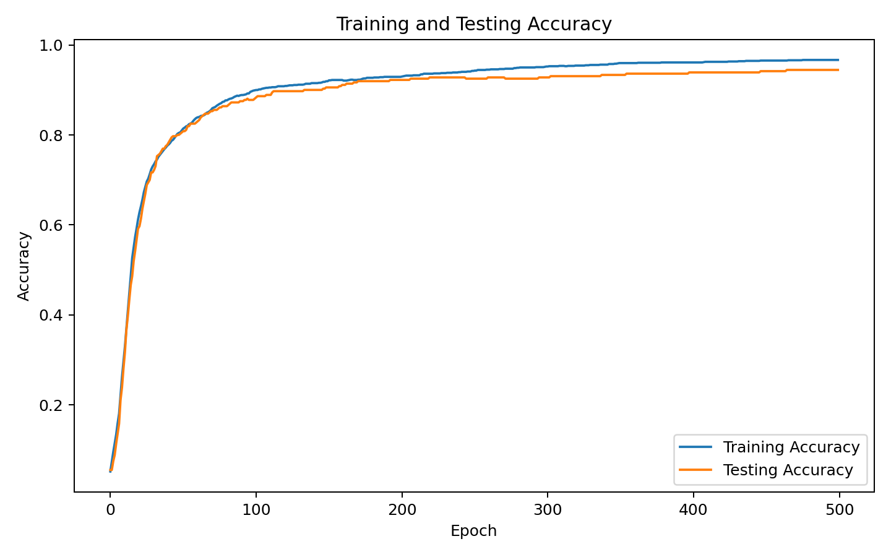
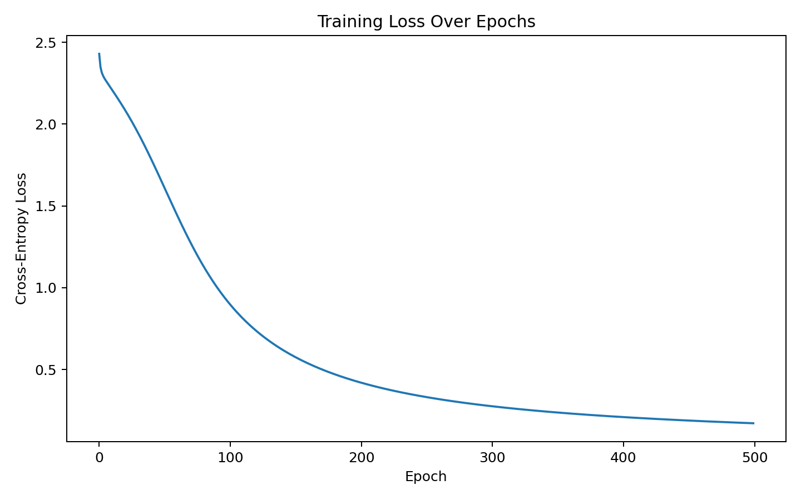
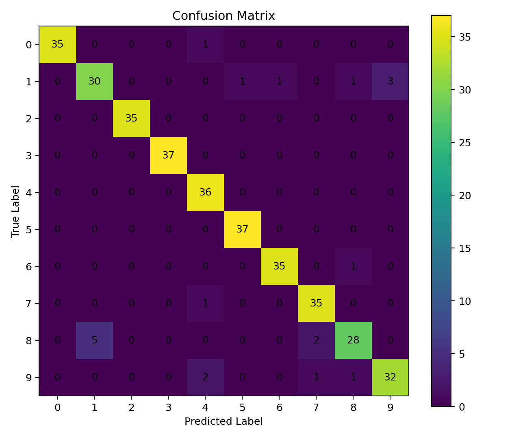
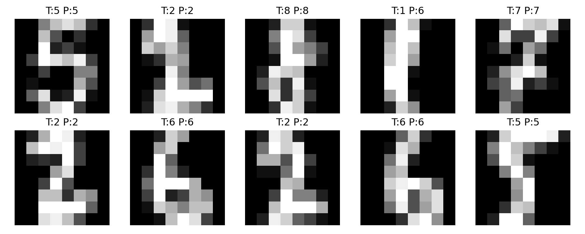

# Backpropagation AI Project

## Overview

This project implements a Neural Network using the Backpropagation Algorithm for handwritten digit classification. The model was trained and evaluated using Python, with performance measured through accuracy metrics, loss curves, and confusion matrix analysis.

## Technologies Used

* Python
* NumPy
* Matplotlib
* Jupyter Notebook
* Machine Learning
* Neural Networks

## Features

* Neural Network Implementation
* Backpropagation Learning Algorithm
* Accuracy Evaluation
* Training Loss Visualization
* Confusion Matrix Analysis
* Sample Prediction Testing

## Project Structure

```text
Backpropagation-AI-Project/
│
├── code/
├── paper/
├── results/
└── README.md
```

## Results

### Accuracy Curve



### Training Loss



### Confusion Matrix



### Sample Predictions



## Research Paper

The complete research paper and documentation are available in the `paper` folder.

## Author

**Bisma Raza**

BS Software Engineering Student

GitHub: https://github.com/Bismaraza

## Installation & Usage

### Prerequisites

* Python 3.x
* Jupyter Notebook
* NumPy
* Matplotlib

### Steps to Run

#### 1. Clone the repository

```bash
git clone https://github.com/Bismaraza/Backpropagation-AI-Project.git
```

#### 2. Navigate to the project folder

```bash
cd Backpropagation-AI-Project
```

#### 3. Install required libraries

```bash
pip install numpy matplotlib notebook
```

#### 4. Open Jupyter Notebook

```bash
jupyter notebook
```

#### 5. Run the notebook

Open the notebook file inside the `code` folder and run all cells.

### Output

The generated results will be available in the `results` folder.

